## Домашнее задание к занятию «Базовые объекты K8S» FOPS-38 (Щербатых А.Е)

---

### Цель задания
В тестовой среде для работы с Kubernetes, установленной в предыдущем ДЗ, необходимо развернуть Pod с приложением и подключиться к нему со своего локального компьютера.

---

### Задание 1. Создать Pod с именем hello-world

1. Создать манифест (yaml-конфигурацию) Pod.
2. Использовать image - gcr.io/kubernetes-e2e-test-images/echoserver:2.2.
3. Подключиться локально к Pod с помощью kubectl port-forward и вывести значение (curl или в браузере).

### Ответ 1.

1. Имеем ВМ под управлением ОС Debian 12. На ней имеем установленный *MicroK8S*.
2. На локальной машине под управлением Windows 11 имеем установленный *kubectl*. (всё это осталось от предыдущего ДЗ).
3. В текстовом редакторе Notepad++ на локальной машине создаю YAML-манифест Pod’а ```hello-world```. Использую в нём *image - gcr.io/kubernetes-e2e-test-images/echoserver:2.2* (Сначала "на автомате" указал расширение для файла как .yml, поэтому словил ошибку при применении манифеста).

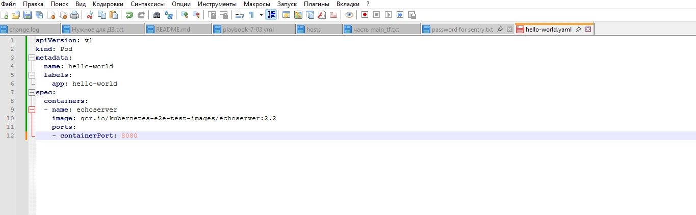

4. Подключаюсь локально к Pod ```hello-world``` с помощью kubectl port-forward.

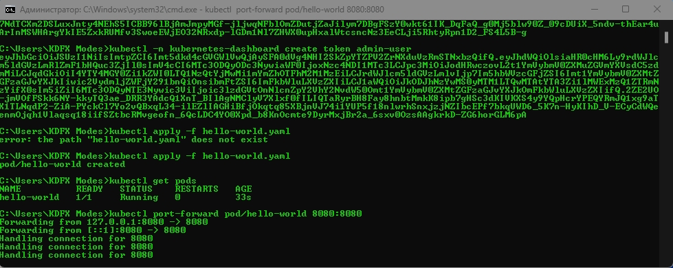

5. Вывожу значение в браузере (использую Edge)

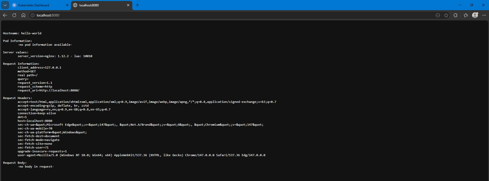

и в командной строке

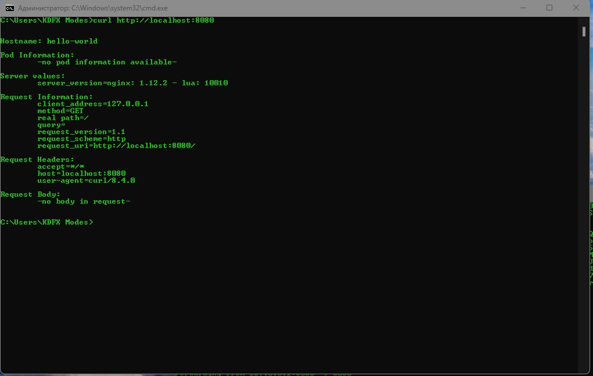

---

### Задание 2. Создать Service и подключить его к Pod
1. Создать Pod с именем netology-web.
2. Использовать image — gcr.io/kubernetes-e2e-test-images/echoserver:2.2.
3. Создать Service с именем netology-svc и подключить к netology-web.
4. Подключиться локально к Service с помощью kubectl port-forward и вывести значение (curl или в браузере).

### Ответ 1.

1. В текстовом редакторе Notepad++ на локальной машине создаю YAML-манифесты Pod ```netology-web``` и Service ```netology-svc```. Использую *image — gcr.io/kubernetes-e2e-test-images/echoserver:2.2*

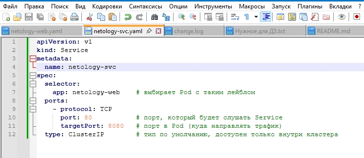

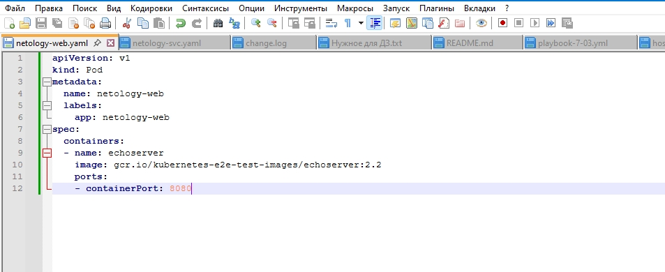

2. Применяю эти манифесты

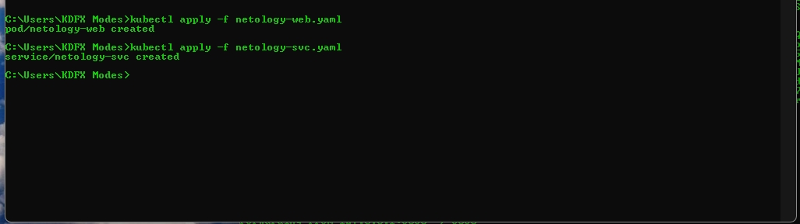

3. Проверяю, что Pod и Service созданы ```kubectl get pods``` и ```kubectl get svc netology-svc```

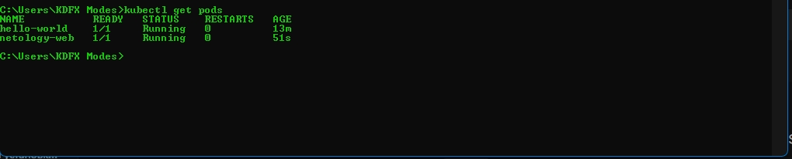

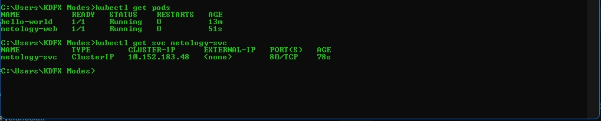

4. Подключаюсь к Service через ```port-forward```

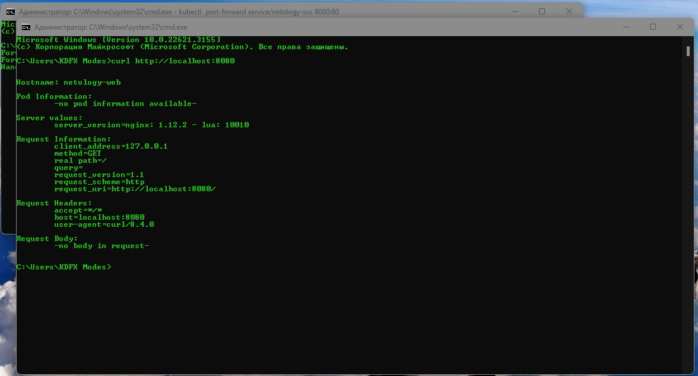

5. Подключился локально к Service с помощью ```kubectl port-forward``` и вывел значение (и через curl и в браузере)

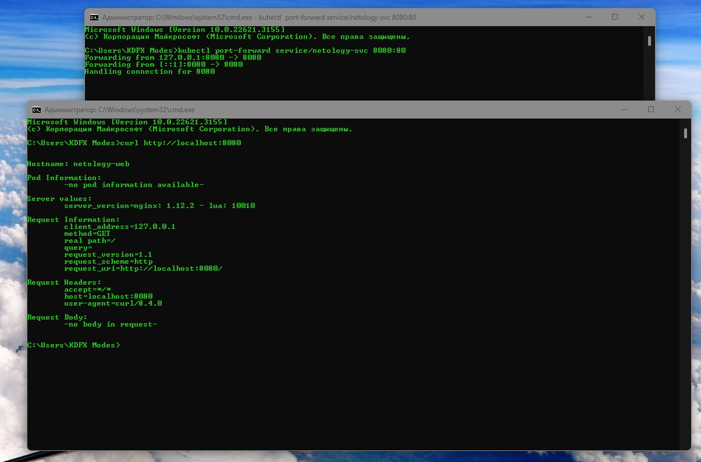

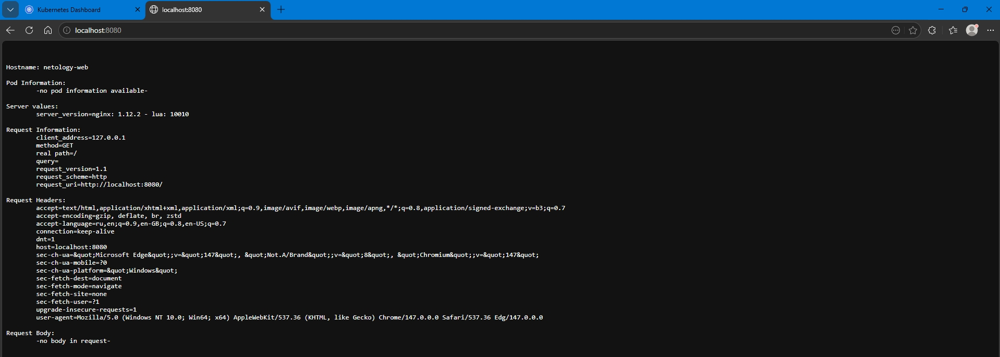
