## Домашнее задание к занятию «Запуск приложений в K8S» FOPS-38 (Щербатых А.Е)

### Задание 1. Создать Deployment и обеспечить доступ к репликам приложения из другого Pod

1. Создать Deployment приложения, состоящего из двух контейнеров — nginx и multitool. Решить возникшую ошибку.
2. После запуска увеличить количество реплик работающего приложения до 2.
3. Продемонстрировать количество подов до и после масштабирования.
4. Создать Service, который обеспечит доступ до реплик приложений из п.1.
5. Создать отдельный Pod с приложением multitool и убедиться с помощью curl, что из пода есть доступ до приложений из п.1.

### Ответ 1.

Создаю [Deployment](https://github.com/Anton-Shcherbatykh/FOPS-38_21/blob/main/21-03/Files/deploy_error_port.yaml)

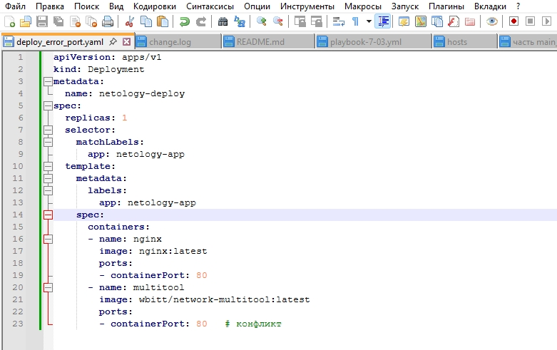

Применяю его. Получаю предупреждение о том, что есть проблема с портом (что верно, т.к. создан Deployment в котором оба контейнера на порту 80).

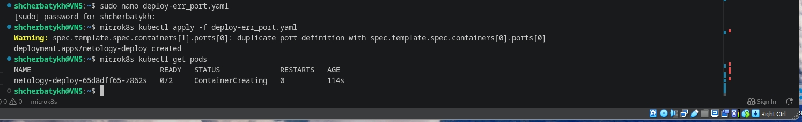

Проверяю статус пода и вижу следующую картину:

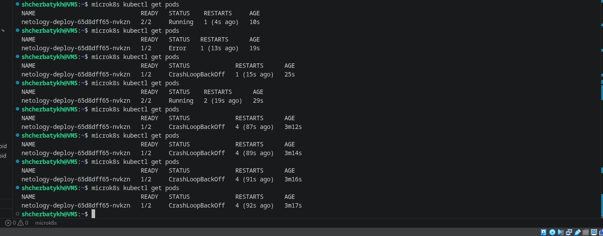

Исправляем ситуацию, явно указав multitool использовать порт 1180 (создадим новый манифест с названием ...)

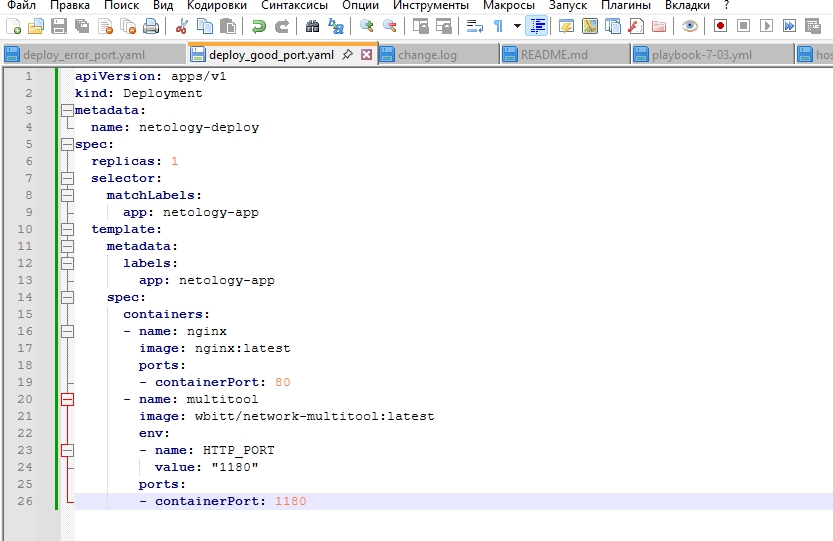

Затем удаляю старый Deployment и применяю новый. Проверяю статус "поднятых" подов

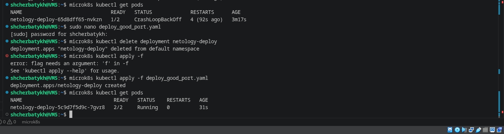

После запуска увеличиваю количество реплик работающего приложения до 2.

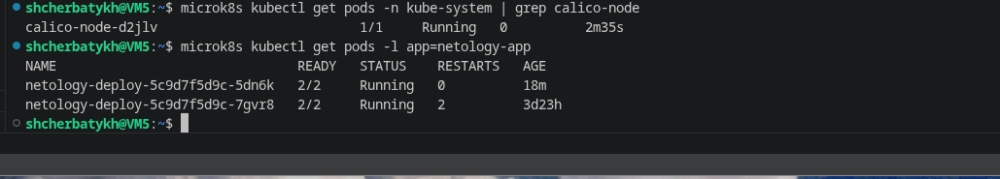

Создаю Service, который обеспечит доступ до реплик приложений из п.1

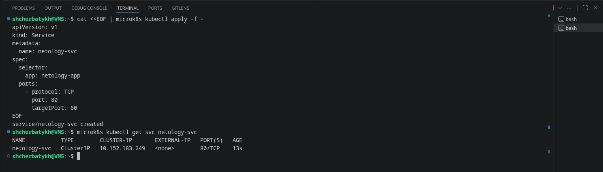

Создать отдельный Pod с приложением multitool

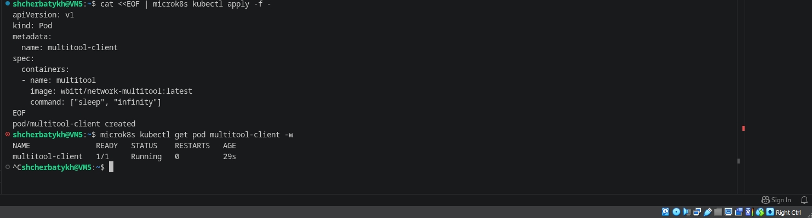

Проверяю с помощью curl, что из пода есть доступ до приложений из п.1

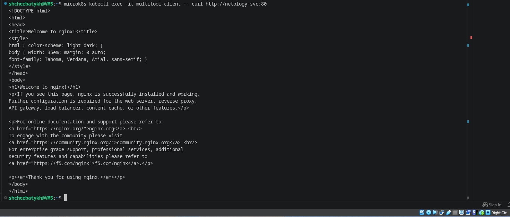

---

### Задание 2. Создать Deployment и обеспечить старт основного контейнера при выполнении условий

1. Создать Deployment приложения nginx и обеспечить старт контейнера только после того, как будет запущен сервис этого приложения.
2. Убедиться, что nginx не стартует. В качестве Init-контейнера взять busybox.
3. Создать и запустить Service. Убедиться, что Init запустился.
4. Продемонстрировать состояние пода до и после запуска сервиса.

### Ответ 2.

Создаю [манифест Deployment с init-контейнером](https://github.com/Anton-Shcherbatykh/FOPS-38_21/blob/main/21-03/Files/deployment-with-init.yaml)

Применяю Deployment и смотрю состояние Pod'а. Вижу, что Pod находится в состоянии ```Init:0/1```

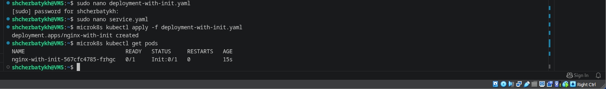

Проверяю логи init-контейнера. Вижу, что nginx не стартует.

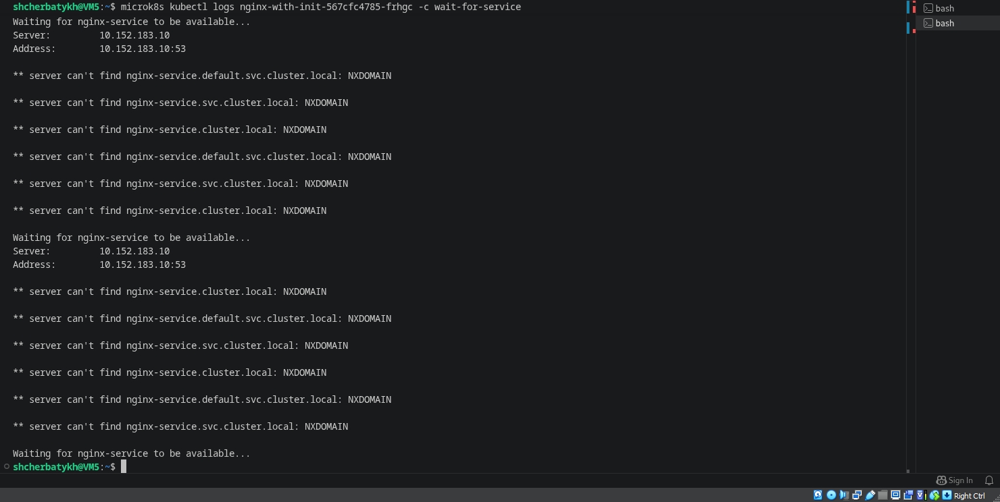

Создаю [манифест Service](https://github.com/Anton-Shcherbatykh/FOPS-38_21/blob/main/21-03/Files/service.yaml)

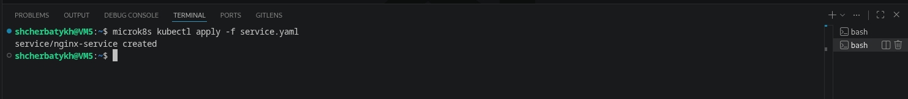

Наблюдаю за запуском ```microk8s kubectl get pods -w```

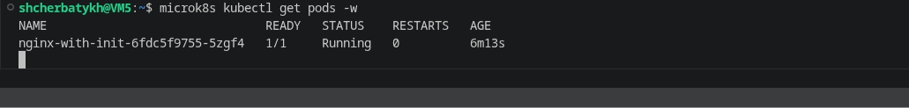

Смотрим информацию о завершённом init-контейнере ```microk8s kubectl describe pod nginx-with-init-6fdc5f9755-5zgf4```

Нахожу в выводе секцию ```Init Containers``` → ```wait-for-service```

```bash
State:          Terminated
  Reason:       Completed
  Exit Code:    0
```

Это нам показыает, что init-контейнер успешно завершился после того, как сервис стал доступен.

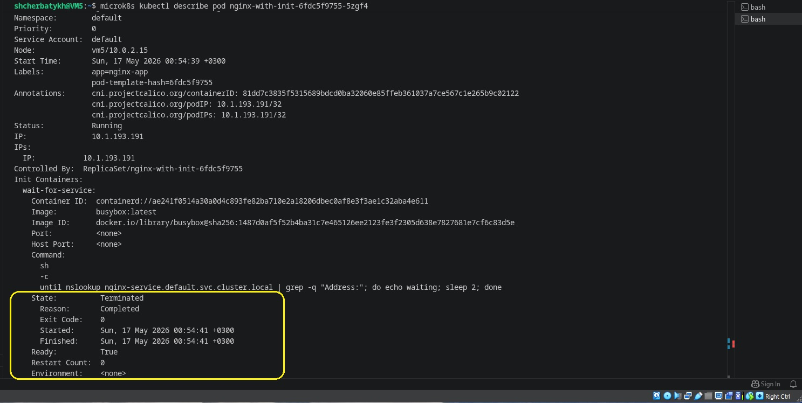


