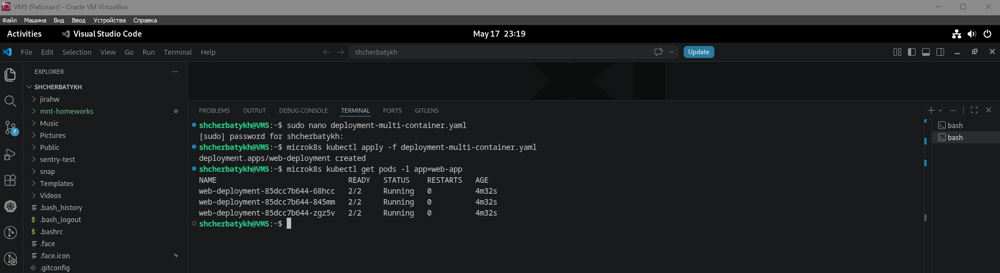

## Домашнее задание к занятию «Сетевое взаимодействие в Kubernetes» FOPS-38 (Щербатых А.Е.)

---

### Задание 1: Настройка Service (ClusterIP и NodePort)

**Задача**

Развернуть приложение из двух контейнеров (nginx и multitool) и обеспечить доступ к ним:

- Внутри кластера через ClusterIP.
- Снаружи через NodePort.

**Шаги выполнения**

1. Создать Deployment с двумя контейнерами:

- nginx (порт 80).
- multitool (порт 8080).
- Количество реплик: 3.

2. Создать Service типа ClusterIP, который:

- Открывает nginx на порту 9001.
- Открывает multitool на порту 9002.

3. Проверить доступность изнутри кластера:

```bash
 kubectl run test-pod --image=wbitt/network-multitool --rm -it -- sh
 curl <service-name>:9001 # Проверить nginx
 curl <service-name>:9002 # Проверить multitool
```

4. Создать Service типа NodePort для доступа к nginx снаружи.
5. Проверить доступ с локального компьютера:

```curl <node-ip>:<node-port>```

или через браузер.

---

## Задание 2: Настройка Ingress

**Задача**

Развернуть два приложения (frontend и backend) и обеспечить доступ к ним через Ingress по разным путям.

**Шаги выполнения**

1. Развернуть два Deployment:

- frontend (образ nginx).
- backend (образ wbitt/network-multitool).

2. Создать Service для каждого приложения.
3. Включить Ingress-контроллер:

```microk8s enable ingress```

4. Создать Ingress, который:

- Открывает frontend по пути /.
- Открывает backend по пути /api.

5. Проверить доступность:

 ```bash
 curl <host>/
 curl <host>/api
```

или через браузер.

---

### Ответ 1.

1. Создаю манифест [Deployment с двумя контейнерами и 3 репликами](https://github.com/Anton-Shcherbatykh/FOPS-38_21/blob/main/21-04/Files/deployment-multi-container.yaml)

*Пояснение: multitool по умолчанию слушает порт 80, но переменная HTTP_PORT=8080 заставляет его использовать порт 8080. Это исключит конфликт с nginx.*

Применяю:

```bash
microk8s kubectl apply -f deployment-multi-container.yaml
```

Проверяю, что все три реплики запустились:

```bash
microk8s kubectl get pods -l app=web-app
```



2. Создаю [Service типа ClusterIP (два порта)](https://github.com/Anton-Shcherbatykh/FOPS-38_21/blob/main/21-04/Files/service-clusterip.yaml)

Применяю:

```bash
microk8s kubectl apply -f service-clusterip.yaml
```

Смотрю, какой IP получил сервис:

```bash
microk8s kubectl get svc web-svc-clusterip
```

3. Проверка доступа изнутри кластера (через тестовый под)

Создаю временный под с multitool и выполняю curl:

```bash
microk8s kubectl run test-pod --image=wbitt/network-multitool --rm -it --restart=Never -- sh
```

Внутри контейнера выполняю:

```bash
curl http://web-svc-clusterip:9001   # Должна появиться страница nginx
curl http://web-svc-clusterip:9002   # Должна появиться информация от multitool
```

Выхожу из пода, набрав exit или нажав Ctrl+D.

Под автоматически удалится.

Скриншот вывода curl прикладываю к отчёту.

4. Создаю Service типа NodePort для доступа к nginx снаружи
5. 
Файл: service-nodeport.yaml

```bash
apiVersion: v1
kind: Service
metadata:
  name: web-svc-nodeport
spec:
  type: NodePort
  selector:
    app: web-app
  ports:
  - name: nginx-port
    protocol: TCP
    port: 80
    targetPort: 80
    nodePort: 30080   # можно указать явно, либо Kubernetes назначит в диапазоне 30000-32767
```

Применяю:

```bash
microk8s kubectl apply -f service-nodeport.yaml
```

Узнаю назначенный порт (если не указал 30080):

```bash
microk8s kubectl get svc web-svc-nodeport
```

В колонке PORT(S) будет что-то вроде 80:30080/TCP.

5. Проверка доступа с локального компьютера (хоста Windows)

Мне понадобится IP-адрес виртуальной машины, который доступен с моей локальной машине с Windows.

Если у меня режим NAT в VirtualBox, нужно настроить проброс порта (порт хоста, например 30080 → порт гостя 30080) или переключить сеть на мост (Bridge). Проще всего — использовать мост, чтобы ВМ получила IP моей локальной сети.

Узнаю IP ВМ: в Debian выполните ```ip a | grep "inet " | grep -v 127.0.0.1. Если у вас мост, вы увидите адрес типа 192.168.1.x```.

На Windows открываю командную строку и выполняю:

```bash
curl http://<IP_ВМ>:30080
```
Или в браузере перехожу по адресу ```http://<IP_ВМ>:30080```.

Вижу страницу ```Welcome to nginx!```
