## Домашнее задание к занятию «Сетевое взаимодействие в Kubernetes» FOPS-38 (Щербатых А.Е.)

---

### Задание 1: Настройка Service (ClusterIP и NodePort)

**Задача**

Развернуть приложение из двух контейнеров (nginx и multitool) и обеспечить доступ к ним:

- Внутри кластера через ClusterIP.
- Снаружи через NodePort.

**Шаги выполнения**

1. Создать Deployment с двумя контейнерами:

- nginx (порт 80).
- multitool (порт 8080).
- Количество реплик: 3.

2. Создать Service типа ClusterIP, который:

- Открывает nginx на порту 9001.
- Открывает multitool на порту 9002.

3. Проверить доступность изнутри кластера:

```bash
 kubectl run test-pod --image=wbitt/network-multitool --rm -it -- sh
 curl <service-name>:9001 # Проверить nginx
 curl <service-name>:9002 # Проверить multitool
```

4. Создать Service типа NodePort для доступа к nginx снаружи.
5. Проверить доступ с локального компьютера:

```curl <node-ip>:<node-port>```

или через браузер.

---

## Задание 2: Настройка Ingress

**Задача**

Развернуть два приложения (frontend и backend) и обеспечить доступ к ним через Ingress по разным путям.

**Шаги выполнения**

1. Развернуть два Deployment:

- frontend (образ nginx).
- backend (образ wbitt/network-multitool).

2. Создать Service для каждого приложения.
3. Включить Ingress-контроллер:

```microk8s enable ingress```

4. Создать Ingress, который:

- Открывает frontend по пути /.
- Открывает backend по пути /api.

5. Проверить доступность:

 ```bash
 curl <host>/
 curl <host>/api
```

или через браузер.

---

### Ответ 1.

1. Создаю манифест [Deployment с двумя контейнерами и 3 репликами](https://github.com/Anton-Shcherbatykh/FOPS-38_21/blob/main/21-04/Files/deployment-multi-container.yaml)

*Пояснение: multitool по умолчанию слушает порт 80, но переменная HTTP_PORT=8080 заставляет его использовать порт 8080. Это исключит конфликт с nginx.*

Применяю:

```bash
microk8s kubectl apply -f deployment-multi-container.yaml
```

Проверяю, что все три реплики запустились:

```bash
microk8s kubectl get pods -l app=web-app
```


2. Создаю [Service типа ClusterIP (два порта)](https://github.com/Anton-Shcherbatykh/FOPS-38_21/blob/main/21-04/Files/service-clusterip.yaml)

Применяю:

```bash
microk8s kubectl apply -f service-clusterip.yaml
```

Смотрю, какой IP получил сервис:

```bash
microk8s kubectl get svc web-svc-clusterip
```

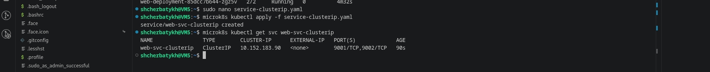

3. Проверка доступа изнутри кластера (через тестовый под)

Создаю временный под с multitool и выполняю curl:

```bash
microk8s kubectl run test-pod --image=wbitt/network-multitool --rm -it --restart=Never -- sh
```

Внутри контейнера выполняю:

```bash
curl http://web-svc-clusterip:9001   # Должна появиться страница nginx
```

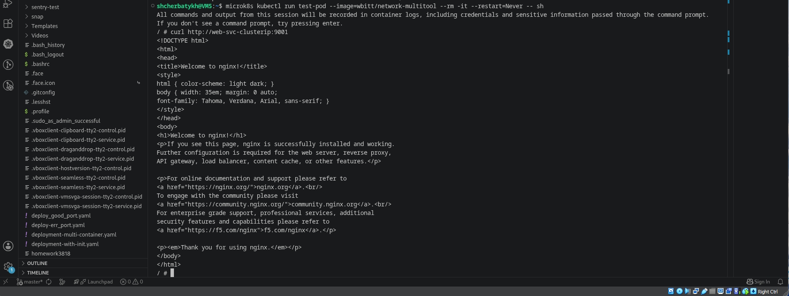

```bash
curl http://web-svc-clusterip:9002   # Должна появиться информация от multitool
```

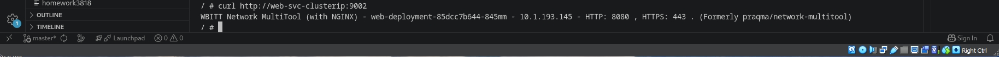

Выхожу из пода, набрав exit. Под автоматически удалился.

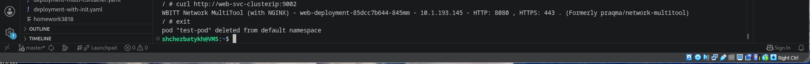

4. Создаю [Service типа NodePort](https://github.com/Anton-Shcherbatykh/FOPS-38_21/blob/main/21-04/Files/service-nodeport.yaml) *для доступа к nginx "снаружи"*

Применяю:

```bash
microk8s kubectl apply -f service-nodeport.yaml
```

Узнаю назначенный порт:

```bash
microk8s kubectl get svc web-svc-nodeport
```

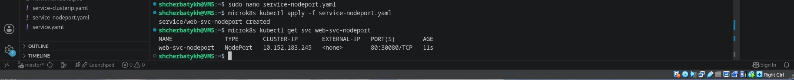

5. Проверка доступа с локального компьютера (хост с ОС Windows)

Настроил проброс портов. На локальной машине открываю браузер и перехожу по адресу ```http://localhost:30080```:

Вижу страницу ```Welcome to nginx!```

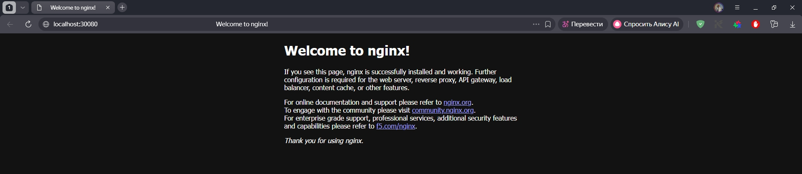

При обращении из командной строки

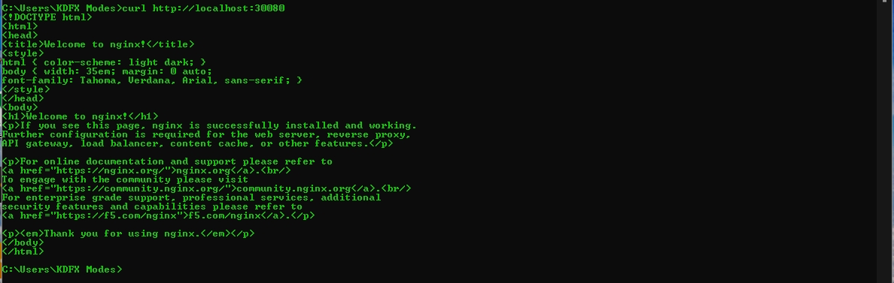

---

### Ответ 2.

1. Включаю Ingress-контроллер
```bash
microk8s enable ingress
```

Проверяю его запуск

```bash
microk8s kubectl get pods -n ingress
```

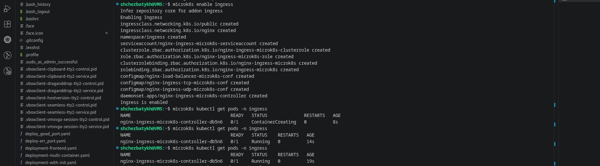

2. Создаю [Deployment](https://github.com/Anton-Shcherbatykh/FOPS-38_21/blob/main/21-04/Files/deployment-frontend.yaml) и [Service](https://github.com/Anton-Shcherbatykh/FOPS-38_21/blob/main/21-04/Files/service-frontend.yaml) для frontend (nginx)

Применяю:

```bash
microk8s kubectl apply -f deployment-frontend.yaml
microk8s kubectl apply -f service-frontend.yaml
```

3. Создаю [Deployment](https://github.com/Anton-Shcherbatykh/FOPS-38_21/blob/main/21-04/Files/deployment-backend.yaml) и [Service](https://github.com/Anton-Shcherbatykh/FOPS-38_21/blob/main/21-04/Files/service-backend.yaml) для backend (multitool)

Применяю:

```bash
microk8s kubectl apply -f deployment-backend.yaml
microk8s kubectl apply -f service-backend.yaml
```

Результат применения для п.п.2 и 3

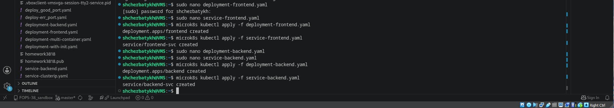

4. Создал [Ingress](https://github.com/Anton-Shcherbatykh/FOPS-38_21/blob/main/21-04/Files/ingress.yaml) с правилами маршрутизации

*Важно: для того чтобы путь /api корректно пробрасывался на backend без префикса /api, использовал аннотацию rewrite-target: /. Это убирает /api из запроса перед передачей в backend.*

Пояснение: Ingress-контроллер nginx, поставляемый с MicroK8s, поддерживает эту аннотацию. Запросы на /api/something будут перенаправляться в backend-сервис на /something.

Применяю:

```bash
microk8s kubectl apply -f ingress.yaml
```

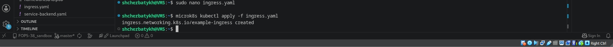

5. Проверяю доступность

Узнаю IP-адрес, на котором слушает Ingress

```bash
microk8s kubectl get ingress
```

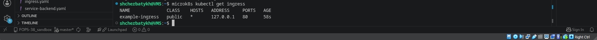

Т.к. Ingress адрес — 127.0.0.1 (доступ только внутри ВМ), то выполняю запросы с самой ВМ:

```bash
curl http://localhost/
```

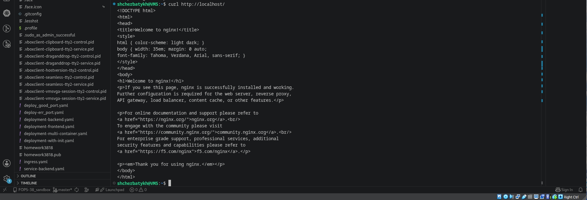

```bash
curl http://localhost/api
```

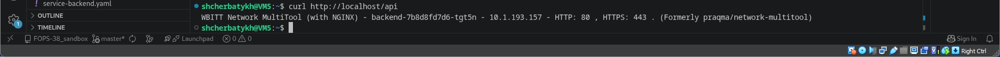

Для "чистоты эксперимента" проверяю доступность с локальной машины под управлением Windows (для этого настроил проброс портов (хост:8080 -> гость:80)).

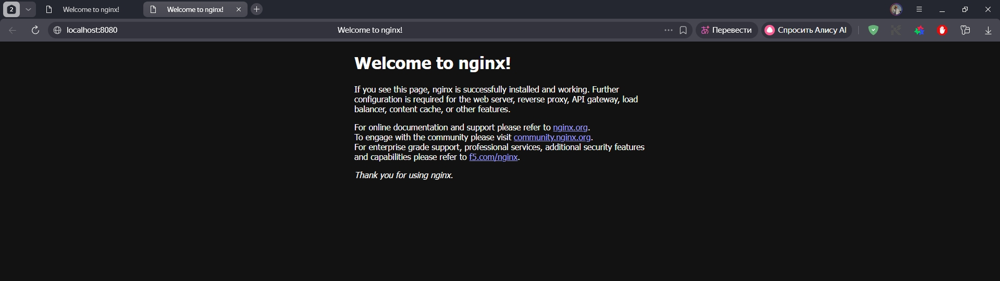

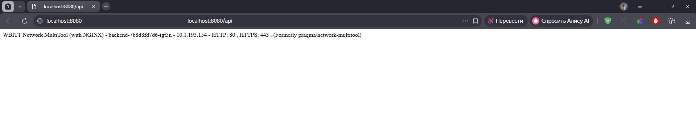
