## Домашнее задание к занятию «Хранение в K8s» FOPS-38 (Щербатых А.Е.)

---

**Цель задания**

Научиться работать с хранилищами в тестовой среде Kubernetes:

- обеспечить обмен файлами между контейнерами пода;
- создавать PersistentVolume (PV) и использовать его в подах через PersistentVolumeClaim (PVC);
- объявлять свой StorageClass (SC) и монтировать его в под через PVC.

Для этих целей с помощью Terraform развернул ВМ в Yandex.Cloud

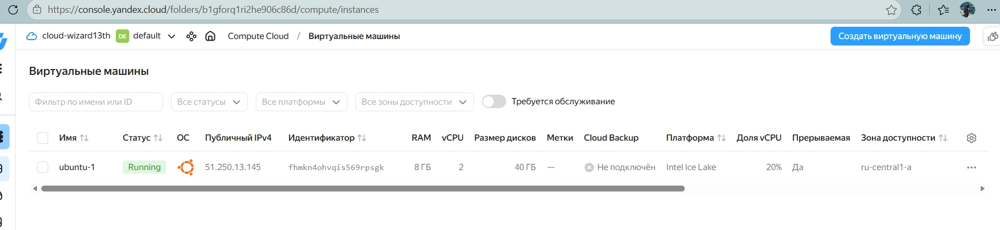

и установил на ней MikroK8s (работал с ним при выполнении предыдущих заданий, показался удобным).

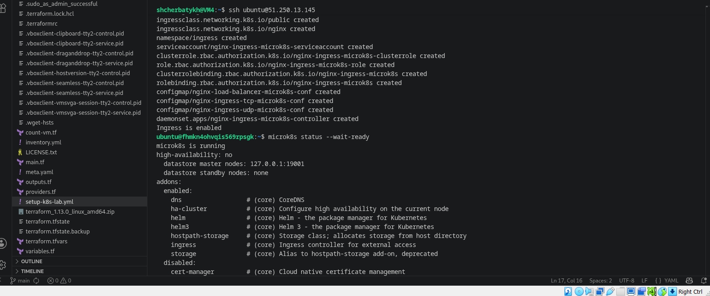

---

### Задание 1. Volume: обмен данными между контейнерами в поде

### Задача

Создать Deployment приложения, состоящего из двух контейнеров, обменивающихся данными.

Шаги выполнения

1. Создать Deployment приложения, состоящего из контейнеров busybox и multitool.
2. Настроить busybox на запись данных каждые 5 секунд в некий файл в общей директории.
3. Обеспечить возможность чтения файла контейнером multitool.

### Ответ 1

Создаю манифест [containers-data-exchange.yaml](https://github.com/Anton-Shcherbatykh/FOPS-38_21/blob/main/21-05/Files/containers-data-exchange.yaml). Применяю его командой ```microk8s kubectl apply -f containers-data-exchange.yaml``` и проверяю, что Pod запустился командой ```microk8s kubectl get pods -l app=data-exchange```.

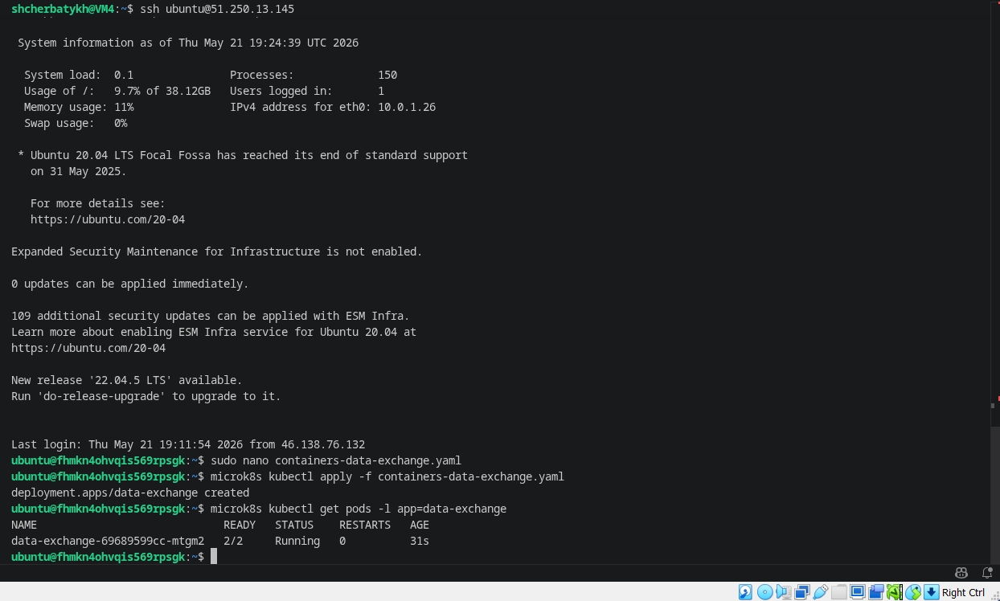

Затем получаю описание Pod'а командой ```microk8s kubectl describe pod -l app=data-exchange```

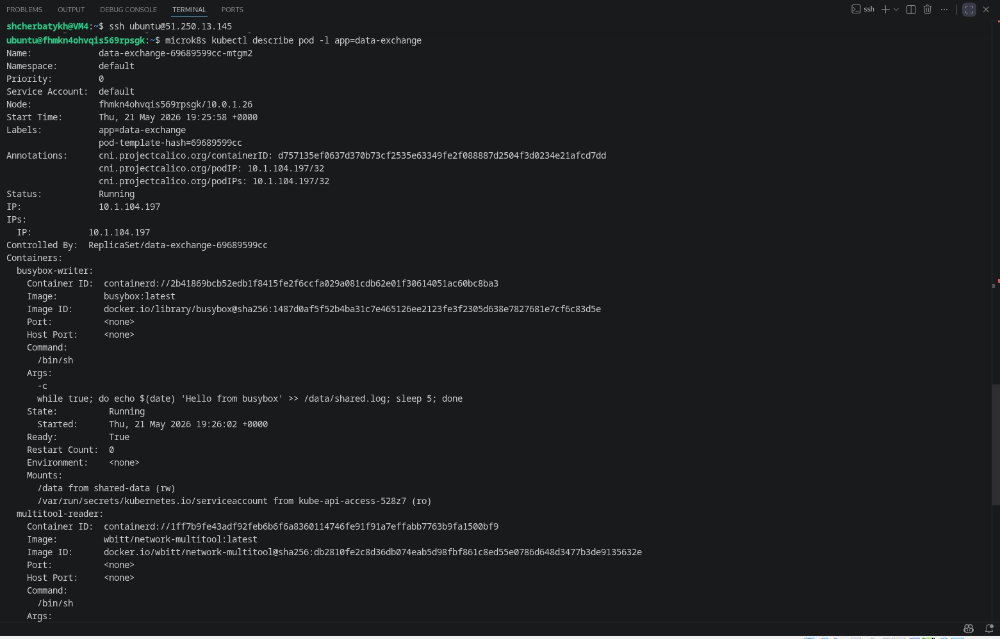

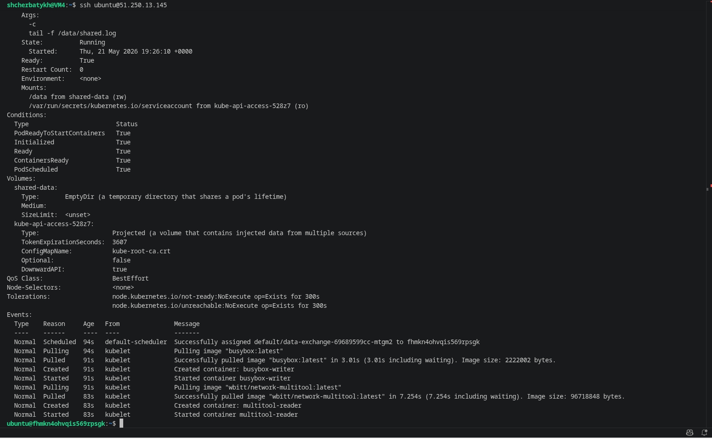

После описанных выше манипуляций проверяю чтение файла контейнером ```multitool```

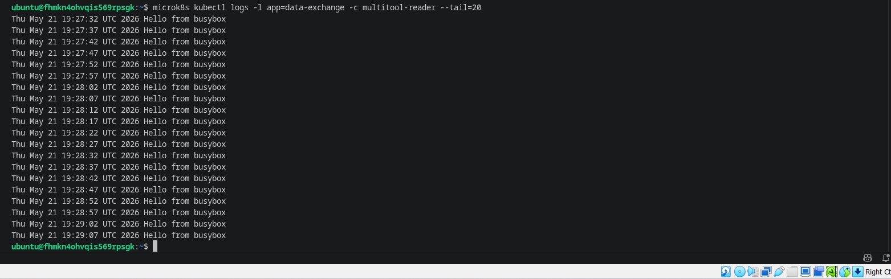

Командой ```microk8s kubectl exec -it deployment/data-exchange -c multitool-reader -- tail -f /data/shared.log``` для чтения файла в реальном времени подключаюсь к контейнеру ```multitool-reader``` и запускаю в нём ```tail -f```

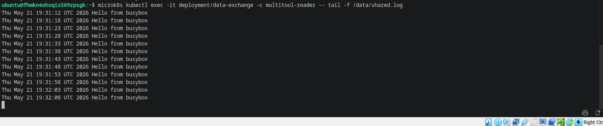

---

### Задание 2. PV, PVC

### Задача

Создать Deployment приложения, использующего локальный PV, созданный вручную.

Шаги выполнения
1. Создать Deployment приложения, состоящего из контейнеров busybox и multitool, использующего созданный ранее PVC
2. Создать PV и PVC для подключения папки на локальной ноде, которая будет использована в поде.
3. Продемонстрировать, что контейнер multitool может читать данные из файла в смонтированной директории, в который busybox записывает данные каждые 5 секунд.
4. Удалить Deployment и PVC. Продемонстрировать, что после этого произошло с PV. Пояснить, почему. (Используйте команду kubectl describe pv).
5. Продемонстрировать, что файл сохранился на локальном диске ноды. Удалить PV. Продемонстрировать, что произошло с файлом после удаления PV. Пояснить, почему.

### Ответ 2

Создаю манифест [pv-pvc.yaml](https://github.com/Anton-Shcherbatykh/FOPS-38_21/blob/main/21-05/Files/pv-pvc.yaml) и применяю его командой ```microk8s kubectl apply -f pv-pvc.yaml```

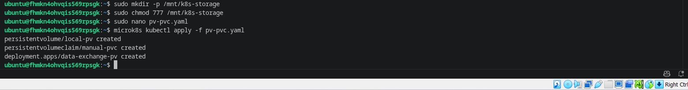

Проверяю создание **PV** и **PVC**

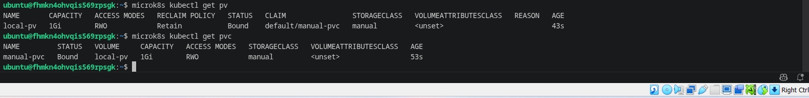

Проверяю, что Pod запустился командой ```microk8s kubectl get pods -l app=data-exchange-pv```

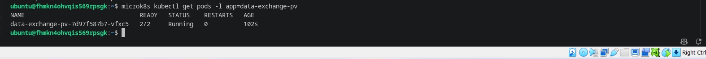

Снова подключаюсь к контейнеру ```multitool-reader``` и запускаю в нём ```tail -f``` для чтения данных.

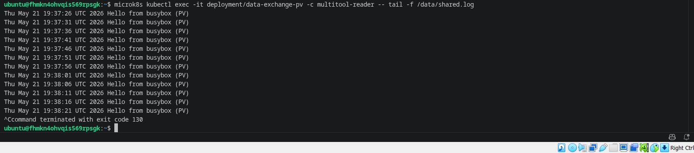

Далее произвожу удаление **Deployment** и **PVC**

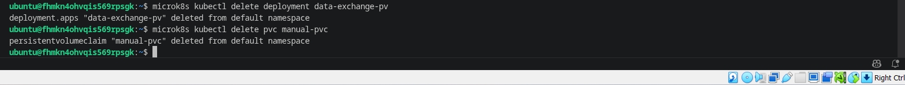

Смотрю, в каком состоянии **PV** после удаления **PVC**

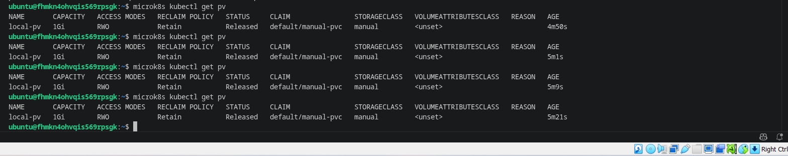

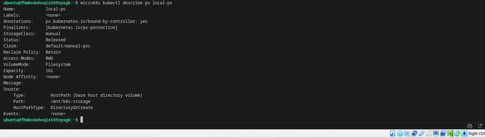

Ожидаемый статус: ```Released```.

Почему?

```persistentVolumeReclaimPolicy: Retain``` – PV не удаляется автоматически при удалении PVC. Он переходит в состояние ```Released```, означающее, что том освобождён, но данные сохранены и PV нельзя сразу использовать повторно (нужно вручную очистить и удалить ```claimRef```).

Проверяю, как сохраняется файл на локальном диске ноды.

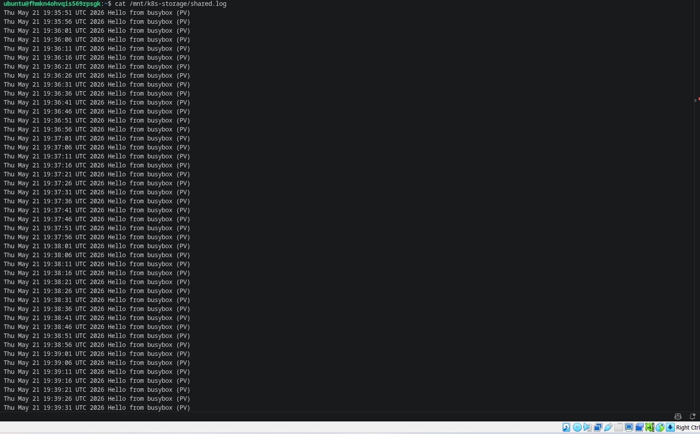

Файл существует, содержит записи. Это потому, что ```hostPath``` – это реальная директория на ноде, и удаление PVC (и даже PV) не удаляет физические файлы.

Удаляю **PV**

```microk8s kubectl delete pv local-pv```

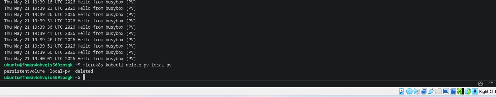

Проверяю, что произошло с файлом после удаления **PV**

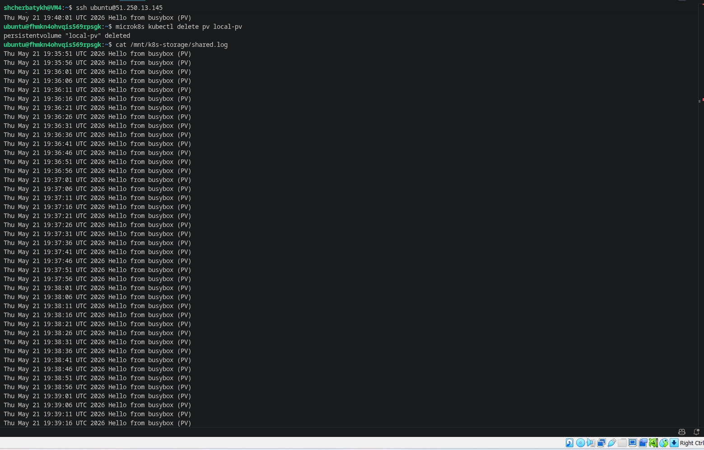

Файл по-прежнему существует. 

PV – это всего лишь объект Kubernetes, представляющий ресурс хранения. Удаление PV не затрагивает физические данные, лежащие на хосте. Файл останется, пока вручную его не удалить из ```/mnt/k8s-storage```. Это особенность ```hostPath``` и политики ```Retain```.

