## Домашнее задание к занятию «Настройка приложений и управление доступом в Kubernetes» FOPS-38 (Щербатых А.Е.)

### Цель задания

Научиться:

- Настраивать конфигурацию приложений с помощью ConfigMaps и Secrets
- Управлять доступом пользователей через RBAC

Это задание поможет освоить ключевые механизмы Kubernetes для работы с конфигурацией и безопасностью. Эти навыки необходимы для уверенного администрирования кластеров в реальных проектах. На практике навыки используются для:

- Хранения чувствительных данных (Secrets)
- Гибкого управления настройками приложений (ConfigMaps)
- Контроля доступа пользователей и сервисов (RBAC)

---

### Задание 1: Работа с ConfigMaps

**Задача**

Развернуть приложение (nginx + multitool), решить проблему конфигурации через ConfigMap и подключить веб-страницу.

**Шаги выполнения**

1. Создать Deployment с двумя контейнерами
nginx
multitool
2. Подключить веб-страницу через ConfigMap
3. Проверить доступность

---

### Задание 2: Настройка HTTPS с Secrets

**Задача**

Развернуть приложение с доступом по HTTPS, используя самоподписанный сертификат.

**Шаги выполнения**

1. Сгенерировать SSL-сертификат
```bash
openssl req -x509 -nodes -days 365 -newkey rsa:2048 \
  -keyout tls.key -out tls.crt -subj "/CN=myapp.example.com"
```
2. Создать Secret
3. Настроить Ingress
4. Проверить HTTPS-доступ

---

### Задание 3: Настройка RBAC

**Задача**

Создать пользователя с ограниченными правами (только просмотр логов и описания подов).

**Шаги выполнения**

1. Включите RBAC в microk8s
```bash
microk8s enable rbac
```
2. Создать SSL-сертификат для пользователя
```bash
openssl genrsa -out developer.key 2048
openssl req -new -key developer.key -out developer.csr -subj "/CN={ИМЯ ПОЛЬЗОВАТЕЛЯ}"
openssl x509 -req -in developer.csr -CA {CA серт вашего кластера} -CAkey {CA ключ вашего кластера} -CAcreateserial -out developer.crt -days 365
```
3. Создать Role (только просмотр логов и описания подов) и RoleBinding
4. Проверить доступ

---

### Ответ 0.

Для целей, указанных в "шапке" к заданиям с помощью Terraform развернул ВМ в Yandex.Cloud и установил на ней MikroK8s

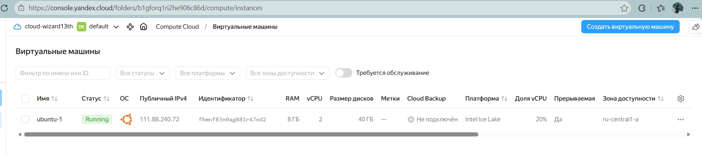

### Ответ 1.

Создаю [ConfigMap с HTML-страницей](https://github.com/Anton-Shcherbatykh/FOPS-38_21/blob/main/21-06/Files/configmap-web.yaml) и применяю, затем создаю [Deployment (nginx + multitool)](https://github.com/Anton-Shcherbatykh/FOPS-38_21/blob/main/21-06/Files/deployment.yaml) и применяю.

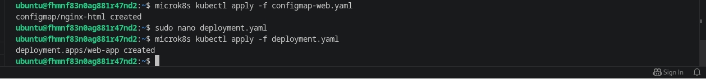

Также создаю [Service для доступа к nginx](https://github.com/Anton-Shcherbatykh/FOPS-38_21/blob/main/21-06/Files/service_curl.yml) 

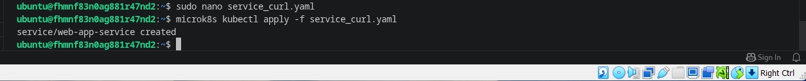

После того, как все "подготовительные работы" проведены, проверяю доступность ConfigMaps через multitool (внутри пода).

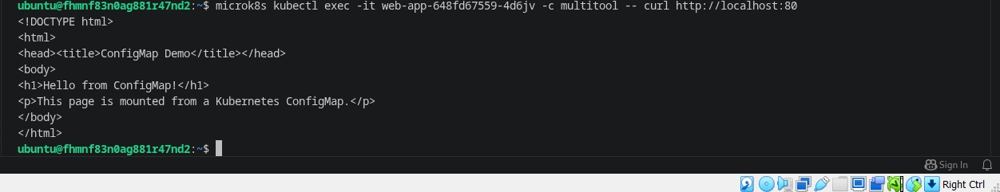

после настройки проброса портов проверяю доступность через браузер

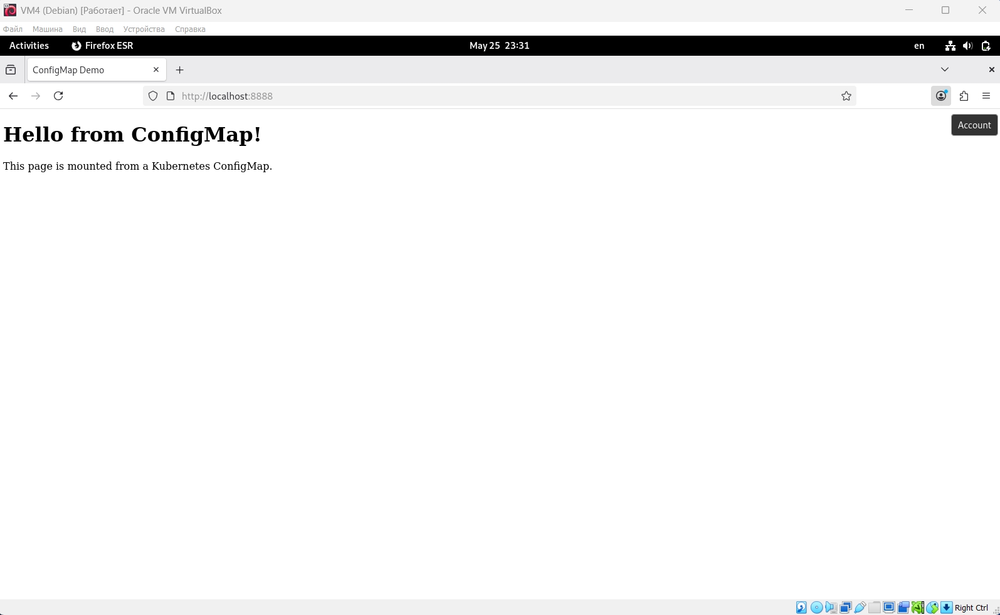

---

### Ответ 2.

Для "чистоты" эскперимента создаю [ConfigMap с веб-страницей](https://github.com/Anton-Shcherbatykh/FOPS-38_21/blob/main/21-06/Files/web-configmap.yaml), а также [Deployment и Service](https://github.com/Anton-Shcherbatykh/FOPS-38_21/blob/main/21-06/Files/deploy-https.yaml) 

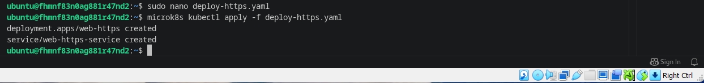

Проверяю POD'ы

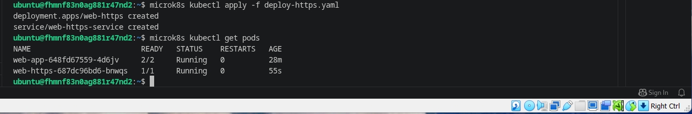

Затем генерирую самоподписанный SSL-сертификат

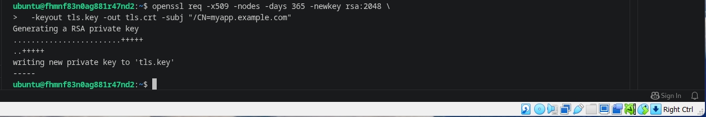

Проверяю, что файлы созданы

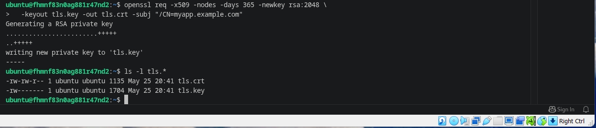

Следующим шагом создаю ```secret типа TLS``` командой 
```bash
microk8s kubectl create secret tls tls-secret --cert=tls.crt --key=tls.key
```
и проверяю, всё ли в порядке с его созданием

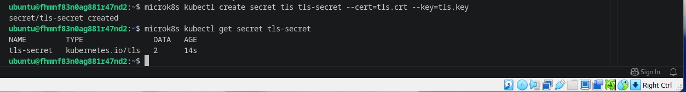

Экспортирую [secret-tls.yaml](https://github.com/Anton-Shcherbatykh/FOPS-38_21/blob/main/21-06/Files/secret-tls.yaml) командой 
```bash
microk8s kubectl get secret tls-secret -o yaml | grep -v '^\s*creationTimestamp:' | grep -v '^\s*resourceVersion:' | grep -v '^\s*uid:' | grep -v '^\s*selfLink:' > secret-tls.yaml
```
чтобы приложить к выполнению задания.

Продолжим. Создаю [Ingress](https://github.com/Anton-Shcherbatykh/FOPS-38_21/blob/main/21-06/Files/ingress-tls.yaml)

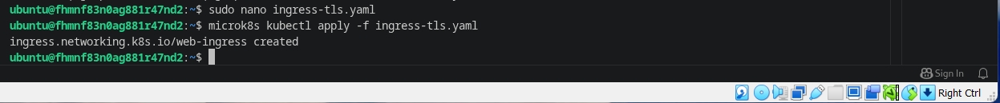

и проверяю, чтобы удостовериться, что не возникло никаких ошибок

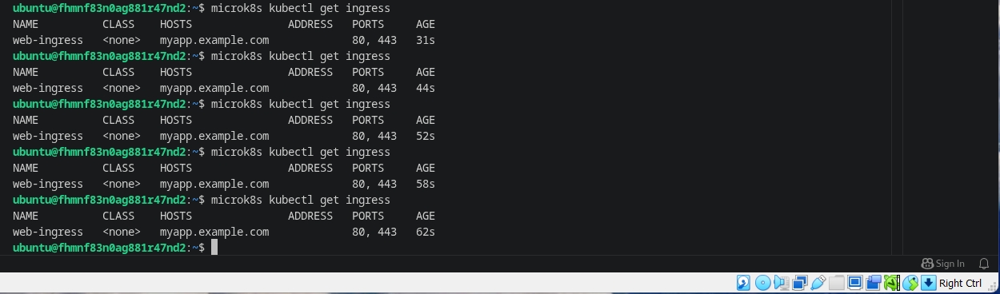

Проверяю https-доступ через ```curl -k```. Поскольку сертификат самоподписанный, используем ключ ```-k``` (insecure). Нужно, чтобы запрос попал на Ingress Controller.

Для этого добавляю запись в /etc/hosts на своей локальной машине (откуда делаю curl)
```bash
echo "111.88.240.72 myapp.example.com" | sudo tee -a /etc/hosts
```

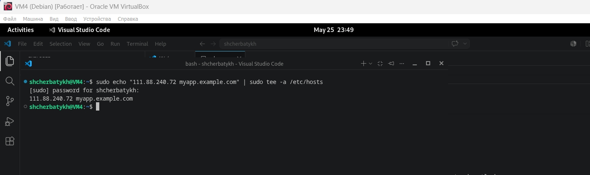

Затем настраиваю проброс портов и выполняю curl

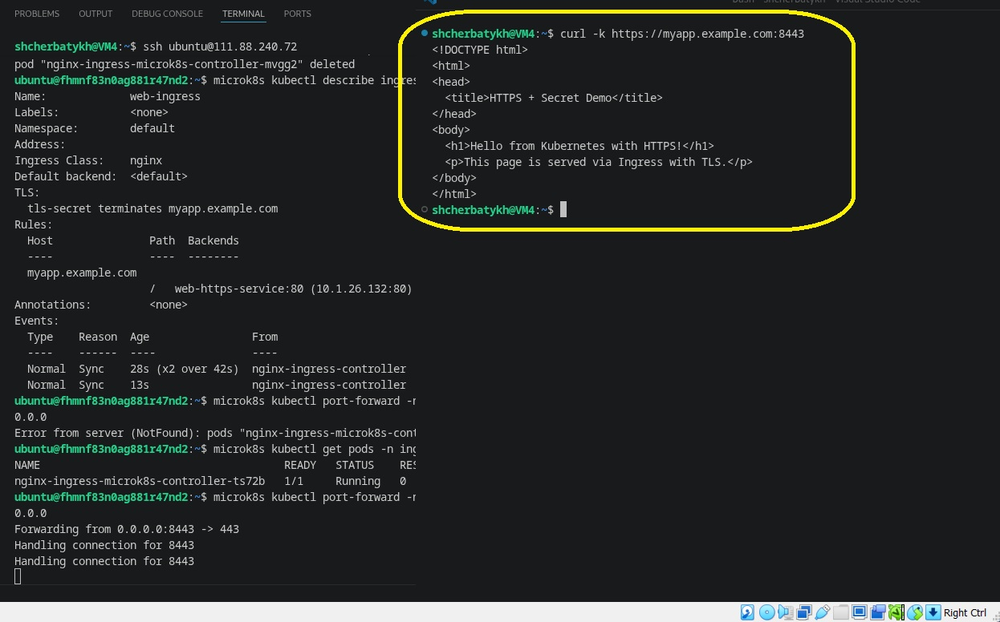

---

### Ответ 3.

Включаю RBAC ```microk8s enable rbac```

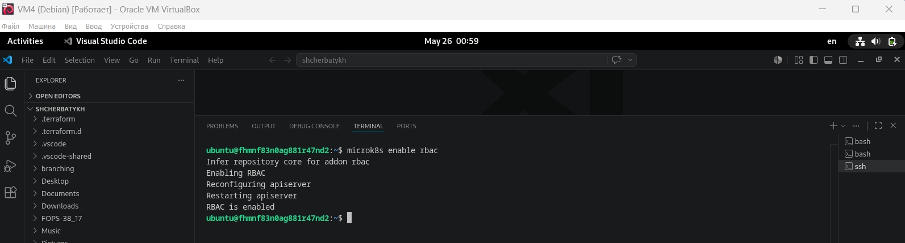

Создаю SSL-сертификат для пользователя **shcherbatykh** (взял на себя смелость заменить предложенного в задании **developer'а**)

Для этого сначала определяю переменные

```bash
USER_NAME=shcherbatykh
```

Пути к CA кластера MicroK8s:
```bash
CA_CERT=/var/snap/microk8s/current/certs/ca.crt
CA_KEY=/var/snap/microk8s/current/certs/ca.key
```
Генерирую ключ и CSR, затем подписываю сертификат

```bash
# 1. Приватный ключ
openssl genrsa -out shcherbatykh.key 2048

# 2. Certificate Signing Request (CSR)
openssl req -new -key shcherbatykh.key -out ${USER_NAME}.csr -subj "/CN=shcherbatykh"

# 3. Подпись сертификата с использованием CA кластера
sudo openssl x509 -req -in shcherbatykh.csr -CA ${CA_CERT} -CAkey ${CA_KEY} -CAcreateserial -out shcherbatykh.crt -days 365
```
*скриншот банально забыл сделать*

Проверяю, что файлы появились

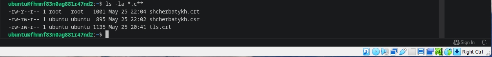

Kubernetes использует ```kubeconfig``` для хранения информации о кластере, пользователях и контекстах. Без него утилита ```kubectl``` не знает:

- Какой API-сервер (адрес кластера) использовать;
- Какие учётные данные (сертификат, ключ) предъявить для аутентификации;
- Какой namespace или контекст выбрать.

Поэтому выполняю настройку kubeconfig для пользователя ```shcherbatykh```

```bash
# Создаю новый контекст для shcherbatykh
microk8s kubectl config set-credentials shcherbatykh --client-certificate=$(pwd)/shcherbatykh.crt --client-key=$(pwd)/shcherbatykh.key --embed-certs=true

# Устанавливаю контекст для shcherbatykh (будет использоваться текущий кластер)
microk8s kubectl config set-context shcherbatykh-context --cluster=$(microk8s kubectl config view -o jsonpath='{.clusters[0].name}') --user=shcherbatykh

# Проверяю контексты
microk8s kubectl config get-contexts
```
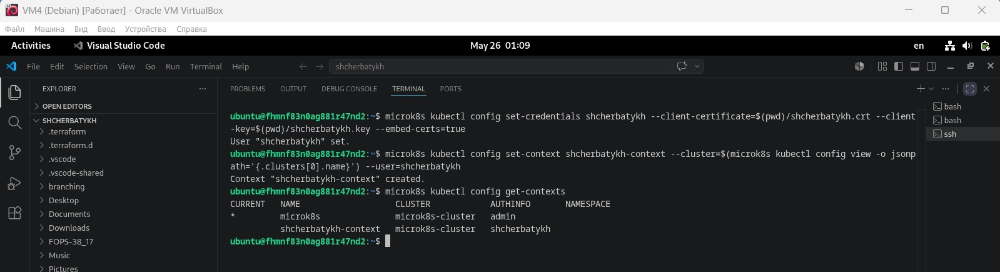

Создаю [Role и RoleBinding](https://github.com/Anton-Shcherbatykh/FOPS-38_21/blob/main/21-06/Files/role-pod-viewer.yaml) и [манифест rolebinding](https://github.com/Anton-Shcherbatykh/FOPS-38_21/blob/main/21-06/Files/rolebinding.yaml). После создания применяю их.

Скриншот проверки прав

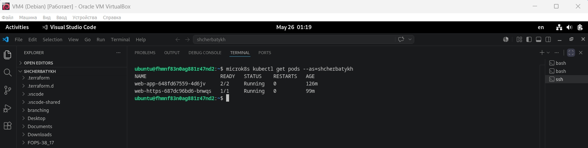
