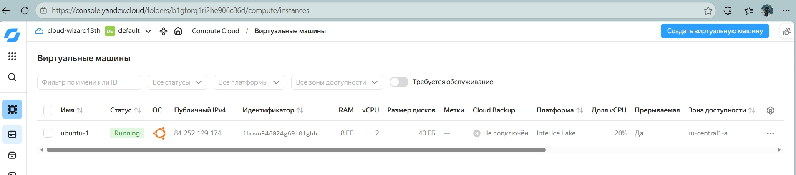
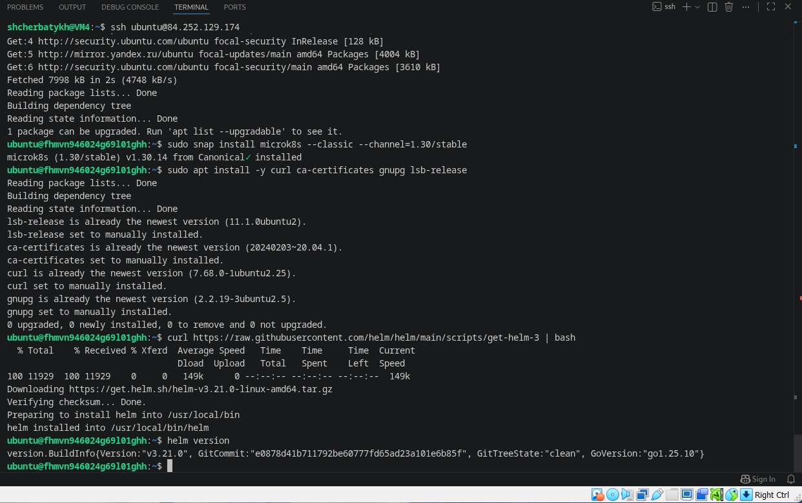
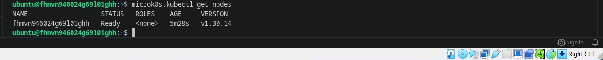
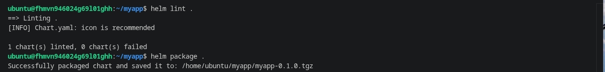

## Домашнее задание к занятию «Helm» FOPS-38 (Щербатых А.Е.)

**Цель задания**

В тестовой среде Kubernetes необходимо установить и обновить приложения с помощью Helm.

### Задание 1. Подготовить Helm-чарт для приложения
1. Необходимо упаковать приложение в чарт для деплоя в разные окружения.
2. Каждый компонент приложения деплоится отдельным deployment’ом или statefulset’ом.
3. В переменных чарта измените образ приложения для изменения версии.

---

### Задание 2. Запустить две версии в разных неймспейсах
1. Подготовив чарт, необходимо его проверить. Запуститe несколько копий приложения.
2. Одну версию в namespace=app1, вторую версию в том же неймспейсе, третью версию в namespace=app2.
3. Продемонстрируйте результат.

---

### Ответ 0.

По уже устоявшейся "традиции" при выполнении ДЗ блока **Kubernetes: основы, применение и администрирование** создаю ВМ в облаке и работаю в ней



После создания ВМ, подготавливаю её к работе по заданию



Проверяю кластер



### Ответ 1.

Создаю новый чарт

```bash
helm create myapp
cd myapp
```

Очищаю чарт от ненужных для выполнения задания файлов

```bash
rm -f templates/deployment.yaml templates/service.yaml templates/serviceaccount.yaml templates/hpa.yaml templates/ingress.yaml templates/NOTES.txt templates/_helpers.tpl templates/httproute.yaml
rm -rf templates/tests
```

Редактирую файл [values.yaml](https://github.com/Anton-Shcherbatykh/FOPS-38_21/blob/main/21-07/Files/values.yaml)

Создаю шаблон для [frontend-deployment.yaml](https://github.com/Anton-Shcherbatykh/FOPS-38_21/blob/main/21-07/Files/frontend-deployment.yaml)

Затем шаблон для [backend-deployment.yaml](https://github.com/Anton-Shcherbatykh/FOPS-38_21/blob/main/21-07/Files/backend-deployment.yaml)

Также создаю сервисы [frontend-service.yaml](https://github.com/Anton-Shcherbatykh/FOPS-38_21/blob/main/21-07/Files/frontend-service.yaml) и [backend-service.yaml](https://github.com/Anton-Shcherbatykh/FOPS-38_21/blob/main/21-07/Files/backend-service.yaml)

Проверяю чарт и упаковываю его 


