## Домашнее задание к занятию «Установка Kubernetes» FOPS-38 (Щербатых А.Е.)

### Задание 1. Установить кластер k8s с 1 master node

1. Подготовка работы кластера из 5 нод: 1 мастер и 4 рабочие ноды.
2. В качестве CRI — containerd.
3. Запуск etcd производить на мастере.
4. Способ установки выбрать самостоятельно.

---

### Ответ 1.

Для выполнения задания развернул 5 виртуальных машин (ВМ) с Ubuntu 20.04 LTS в Yandex.Cloud, которые имеют сетевой доступ друг к другу.

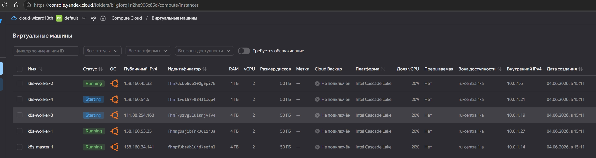

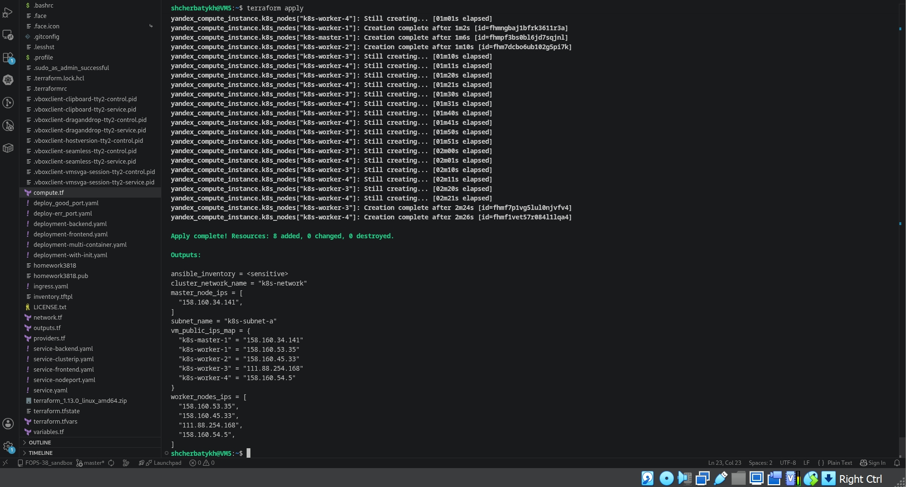

Затем настроим все ВМ.

```bash
# Отключаем Swap (В официальной документации Kubernetes и лучших практиках сообщества настоятельно рекомендуется отключать
# swap на нодах, где планируется запускать рабочую нагрузку Kubernetes. Это считается стандартной практикой для поддержания
# стабильности и производительности кластера.)
sudo swapoff -a
sudo sed -i '/ swap / s/^/#/' /etc/fstab

# Прописываю загрузку модулей ядра для работы сетевых мостов (overlay, br_netfilter)
cat <<EOF | sudo tee /etc/modules-load.d/k8s.conf
overlay
br_netfilter
EOF
sudo modprobe overlay
sudo modprobe br_netfilter

# Настраиваю параметры сети (iptables видит трафик мостов, включение IP-форвардинга)
cat <<EOF | sudo tee /etc/sysctl.d/k8s.conf
net.bridge.bridge-nf-call-iptables = 1
net.bridge.bridge-nf-call-ip6tables = 1
net.ipv4.ip_forward = 1
EOF

# Прменяю настройки sysctl
sudo sysctl --system

# Устанавливаю необходимые зависимости
sudo apt-get update && sudo apt-get install -y apt-transport-https ca-certificates curl

# Устанавливаю containerd в качестве CRI (это позволит обеспечить взаимодействие между компонентами кластера
# и средой выполнения контейнеров).
sudo apt-get install -y containerd
```

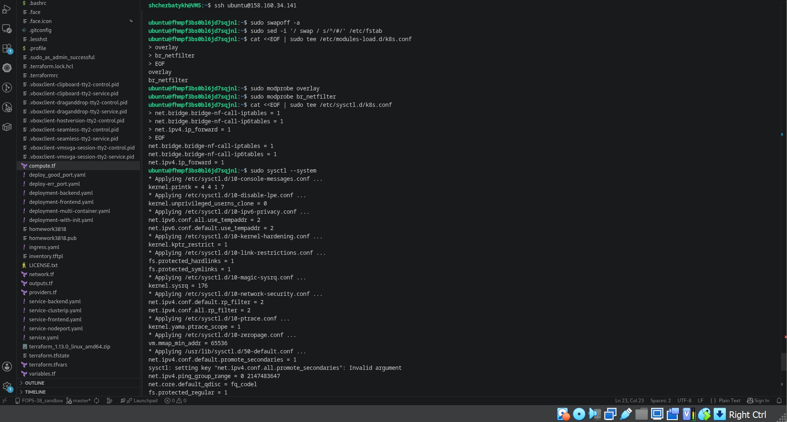

Затем создаю конфигурацию для containerd и перезапускаю его.

```bash
# Генерация конфигурационного файла по умолчанию
sudo mkdir -p /etc/containerd
containerd config default | sudo tee /etc/containerd/config.toml

# Настройка systemd в качестве cgroup driver ( для корректного управления ресурсами и предотвращения
# конфликтов в системе)
sudo sed -i 's/SystemdCgroup = false/SystemdCgroup = true/' /etc/containerd/config.toml

# Перезапуск containerd
sudo systemctl restart containerd
sudo systemctl enable containerd
```

Устанавливаю компоненты Kubernetes ```kubelet```, ```kubeadm``` и ```kubectl```.

Для этого сначала создаю директорию для ключей и устанавливаю права доступа:

```bash
sudo mkdir -p -m 755 /etc/apt/keyrings
```

Затем 

```bash
# Добавляю официальный репозиторий Kubernetes
curl -fsSL https://pkgs.k8s.io/core:/stable:/v1.32/deb/Release.key | sudo gpg --dearmor -o /etc/apt/keyrings/kubernetes-apt-keyring.gpg
echo 'deb [signed-by=/etc/apt/keyrings/kubernetes-apt-keyring.gpg] https://pkgs.k8s.io/core:/stable:/v1.32/deb/ /' | sudo tee /etc/apt/sources.list.d/kubernetes.list

# Устанавливаю компоненты
sudo apt-get update
sudo apt-get install -y kubelet kubeadm kubectl

# Блокирую версии для предотвращения автоматического обновления (В Kubernetes существует политика
# допустимого расхождения версий между некоторыми компонентами (например, между ```kube-apiserver```, ```kubelet``` и ```kubectl```).
# Блокировка версий помогает поддерживать согласованность между компонентами, что снижает риск конфликтов при обновлении).
sudo apt-mark hold kubelet kubeadm kubectl
sudo systemctl enable --now kubelet
```

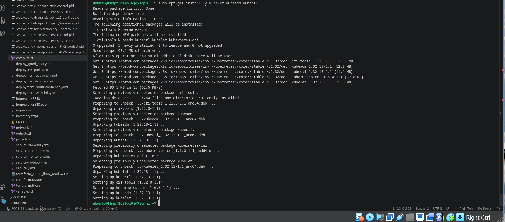

После настройки всех ВМ приступаю к инициализации master-узла.

```bash
sudo kubeadm init --apiserver-advertise-address=158.160.34.141 --pod-network-cidr=10.244.0.0/16
```

Получаю сообщение (см скриншот ниже) об успешной инициализации и сохраняю данные ```kubeadm join```

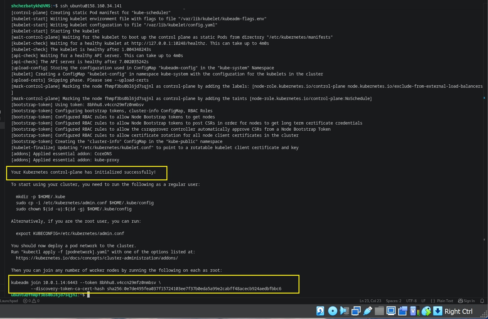

и выполняю следующие команды, чтобы начать использовать кластер

```bash
# Настраиваю kubectl для текущего пользователя (у меня это ubuntu)
mkdir -p $HOME/.kube
sudo cp -i /etc/kubernetes/admin.conf $HOME/.kube/config
sudo chown $(id -u):$(id -g) $HOME/.kube/config
```

Устанавливаю сетевой плагин (CNI) для связи между подами. 

```bash
kubectl apply -f https://raw.githubusercontent.com/projectcalico/calico/v3.25.0/manifests/calico.yaml
```

Теперь можно заняться подключением зависимых (я их назвал worker) узлов

```bash
sudo kubeadm join 10.0.1.14:6443 --token 3fj96f.awv38huvgemz1n3e --discovery-token-ca-cert-hash sha256:0e7de495fea037f15724103ee7f37b0eda5a99e2cabff48acecb924aedbfbbc6
```

После подключения всех 4 worker-узлов, проверяю состояние кластера с master-узла.

```bash
# Смотрю все узлы кластера (д.б. статус Ready для всех 5 узлов)
kubectl get nodes

# Смотрю все поды в системном пространстве имен (все поды должны быть в статусе Running)
kubectl get pods -n kube-system
```

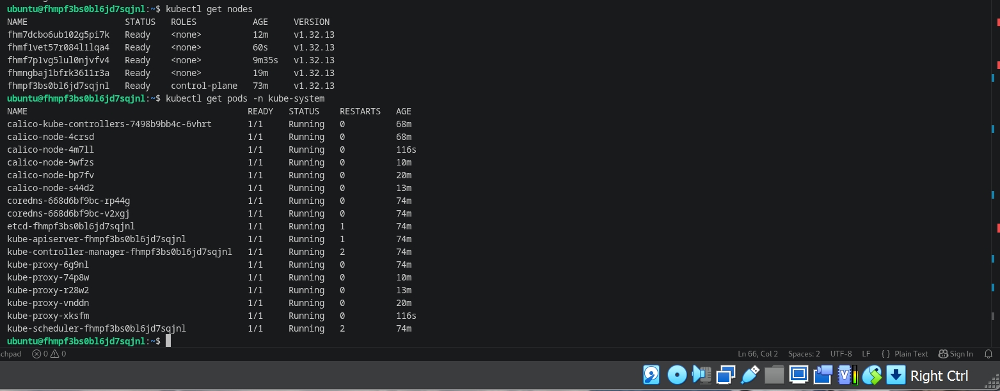

Вижу, что кластер успешно установлен и готов к работе.

Чтобы убедиться, что кластер полностью работоспособен, разворачиваю тестовое приложение на мастер-узле:

```bash
kubectl create deployment nginx --image=nginx
kubectl expose deployment nginx --port=80 --type=NodePort
```

После этого получаю список сервисов командой ```kubectl get svc``` 

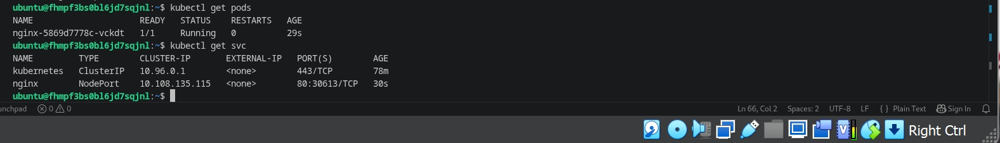

и, взяв значение NodePort, открываю в браузере своей локальной ВМ страницу http://111.88.254.168:30613 (ip-адрес worker-узла №3), и вижу приветственную страницу Nginx. 

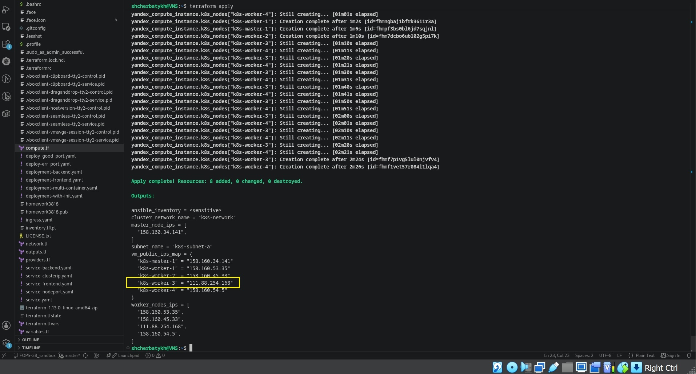

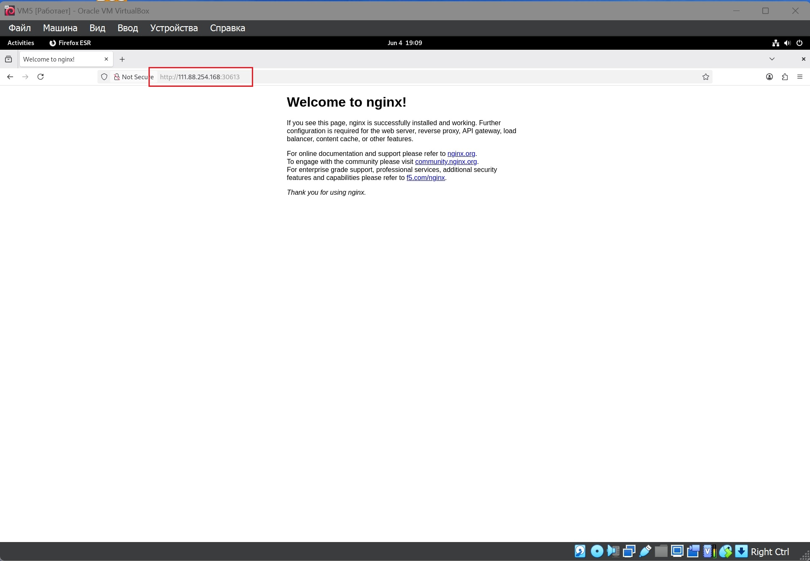

Также проверяю это командой 

```bash
curl http://10.0.1.19:30613
```

c мастер-узла

и получаю

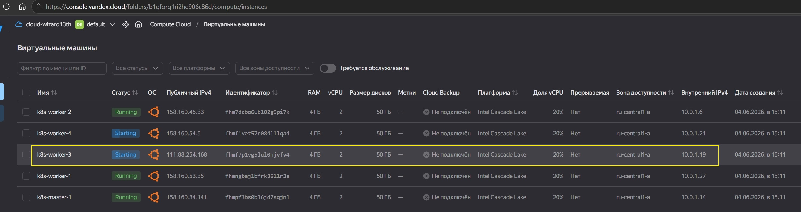

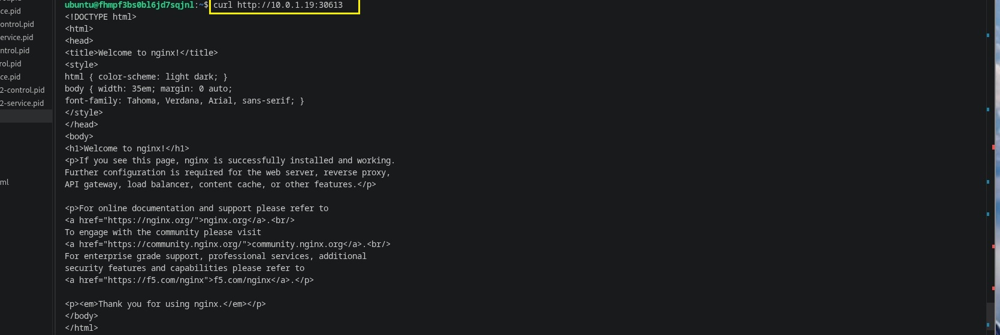


Данный результат подтверждает, что всё настроено и работает корректно.
